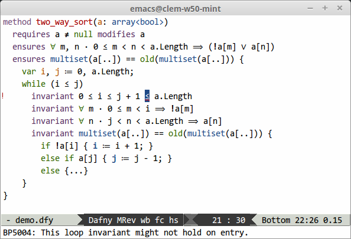
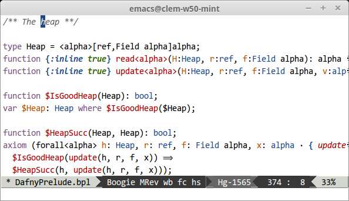
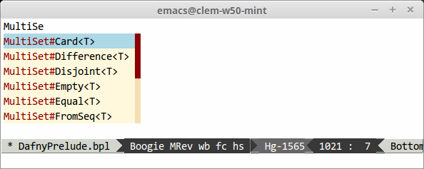
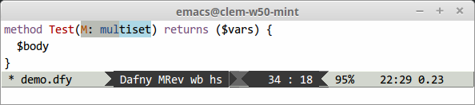
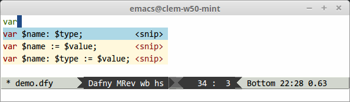
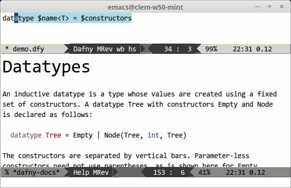
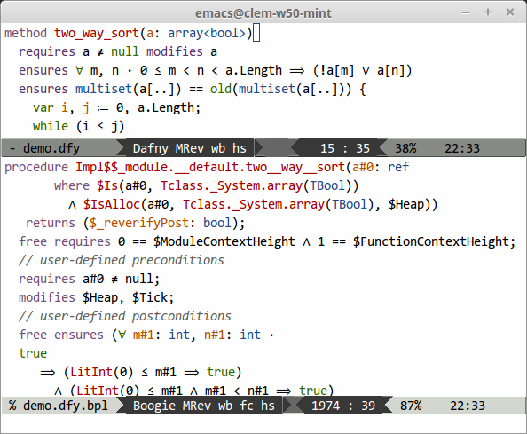

# Boogie friends

A collection of tools for interacting with Boogie and related languages.

## Emacs package (`boogie-mode`, `dafny-mode`)

The `boogie-friends` package is an experimental collection of Emacs modes for
writing verified programs in languages of the Boogie family. Dafny and Boogie
are the two currently supported languages. Features include:

* Syntax highlighting
* Real-time compilation (using `flycheck`)
* Completion (using `company`)
* Code folding (using `hideshow`)
* Prettification (using `prettify-symbols-mode`)

In addition, the Dafny mode offers:

* (A few) Snippets (using `yasnippet`)
* (Some) In-Emacs documentation
* (Experimental) Navigation between Dafny and Boogie source files
* (Some support for) indentation
* (Some support for) jumping to a definition

### Some pictures:

#### A Dafny buffer



Notice the error highlighting, the symbol beautification (`forall` appears as `∀`), and the code folding on the last line!

#### A Boogie buffer



#### Completion and snippets





#### Documentation (Dafny only)



#### Browsing the Boogie translation of a Dafny file



### Setup

#### Automatic

1. Setup [MELPA](http://melpa.org/#/getting-started)

    In your `.emacs`, add these three lines if you don't have them yet:

    ```elisp
    (require 'package) ;; You might already have this line
    (add-to-list 'package-archives '("melpa" . "http://melpa.org/packages/") t)
    (package-initialize) ;; You might already have this line
    ```

2. Install the package: `M-x package-install RET boogie-friends RET`

3. Indicate the paths to your Dafny and Boogie installations:

    In your `.emacs`:

    ```elisp
    (defun setup-boogie-friends ()
      (interactive)
      (setq flycheck-dafny-executable "PATH-TO-DAFNY")
      (setq flycheck-boogie-executable "PATH-TO-BOOGIE"))

    (add-hook 'boogie-friends-hook #'setup-boogie-friends)
    ```

### Keybindings

#### Dafny mode

* <kbd>TAB</kbd> auto-indents.
* <kbd>C-c C-?</kbd> opens the Dafny docs.
* <kbd>&lt;C-down-mouse-1></kbd> looks for the definition of the function under point in open buffers.
* <kbd>C-c C-a</kbd> translates the current file to Boogie and shows the translated file.
* <kbd>C-c C-j</kbd> or <kbd>C-S-down-mouse-1</kbd> (aka <kbd>Ctrl-Shift-Click</kbd>) jumps to the closest matching location int the Boogie buffer.

* After inserting a snippet, <kbd>TAB</kbd> and <kbd>S-TAB</kbd> navigate the fields, and <kbd>C-d</kbd> removes the current field entirely.

* During completion, <kbd>C-h</kbd> shows documentation for the current snippet, if available.

#### All modes

<kbd>C-c C-c</kbd> re-verifies the current file. With prefix arg (<kbd>C-u C-c C-c</kbd>), runs the prover with extra arguments (see below)
<kbd>S-TAB</kbd> (aka <kbd>&lt;backtab></kbd> aka <kbd>Shift-Tab</kbd>) manually cycles through reasonable indentation levels

### Tips

#### General

* Completion, indentation, snippets and syntax coloring should work out of the box.

#### Real-time error highlighting

Real-time error highlighting is enabled by default for all languages. You can disable it:

* Entirely by adding `(flycheck-mode -1)` after the `(interactive)` line in `setup-boogie-friends` above.

* For just one language (say Dafny) by adding `(setq flycheck-disabled-checkers '(dafny))` to your `.emacs`.

#### Font support

If you see blocks instead of proper characters, or tall characters, or ugly characters:

1. Install a good font and restart Emacs ([Symbola](http://users.teilar.gr/~g1951d/Symbola.zip), DejaVu Sans Mono, FreeMono, STIX, Unifont, Segoe UI Symbol, Arial Unicode and Cambria Math should all work).

2. If that doesn't work, setup font fallback by adding the following to your `.emacs` (replace `"Symbola"` by the name of your font):
    ```elisp
    (set-fontset-font t 'unicode (font-spec :name "Symbola") nil 'append)
    ```

3. If that still doesn't work, turn of prettification entirely by adding the following to `setup-boogie-friends` above:
    ```elisp
    (prettify-symbols-mode -1)
    ```

#### Custom prover configurations

Each time `boogie-friends` calls a prover, it collects arguments from four sources:

* `LANGUAGE-prover-args`, the list of arguments passed to the prover in the default configuration (i.e. `dafny-prover-args` and `boogie-prover-args`). This has pretty good defaults, and probably shouldn't be changed.

* `LANGUAGE-prover-custom-args`, a list of extra flags. This is empty by default, and is a good place to add your own flags.

 `LANGUAGE-prover-local-args`, another list of extra flags. This is empty by default, and is a good place to add per-file or per-directory flags (see below).

* `LANGUAGE-prover-alternate-args`, a list of flags added to the prover invocation when running `compile` with a prefix argument (<kbd>C-u C-c C-c</kbd>). This is a good place to add flags that you do not always need; for example `"/z3opt:TRACE=true"` (this is the default).

An example configuration might thus look like this:

```elisp
;; Don't allow assumptions
(setq dafny-prover-custom-args '("/noCheating:1"))

;; Get more debug output when verifying with C-u C-c C-c
(setq dafny-prover-alternate-args '("/proverWarnings:2" "/traceverify" "/z3opt:TRACE=true" "/trace" "/traceTimes" "/tracePOs"))
```

The `LANGUAGE-prover-local-args` is useful if a file requires specific flags: in that case you can set the `LANGUAGE-prover-local-args` [in just that file](https://www.gnu.org/software/emacs/manual/html_node/emacs/Specifying-File-Variables.html) or [in the corresponding directory](http://www.gnu.org/software/emacs/manual/html_node/emacs/Directory-Variables.html).

For example, you can add the following to the top of a file:

```elisp
// -*- dafny-prover-local-args: ("/vcsMaxKeepGoingSplits:5" "/proverMemoryLimit:250") -*-
```

### Acknowledgments

The documentation that ships with this package is auto-generated from the [Dafny Quick Reference](http://research.microsoft.com/en-us/projects/dafny/reference.aspx).

### Pull requests are welcome!

Clone the repo:

```bash
mkdir -p ~/.emacs.d/lisp/ && cd ~/.emacs.d/lisp/
git clone https://github.com/boogie-org/boogie-friends
```

Then in your .emacs (in addition to the stuff above):

```elisp
(add-to-list 'load-path "~/.emacs.d/lisp/boogie-friends/emacs/")
(require 'dafny-mode)
(require 'boogie-mode)
```
