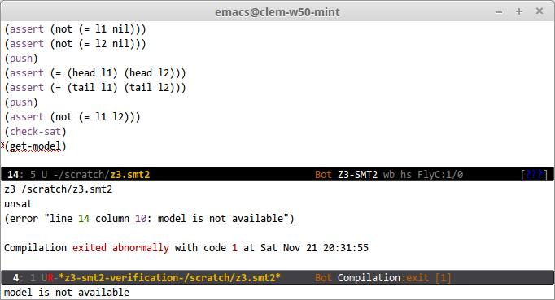

# Boogie friends

A collection of tools for interacting with Boogie and related languages.

## Emacs package (`boogie-mode`, `dafny-mode`, `z3-smt2-mode`)

The `boogie-friends` package is an experimental collection of Emacs modes for
writing verified programs in z3 and languages of the Boogie family (including Dafny).

Notable features are listed below:

* Syntax highlighting
* Real-time verification (using `flycheck`)

In addition, the Dafny and Boogie modes offer:

* Completion (using `company`)
* Code folding (using `hideshow`)
* Prettification (using `prettify-symbols-mode`)

And the Dafny mode additionally also has:

* (A few) Snippets (using `yasnippet`)
* (Some) In-Emacs documentation
* (Experimental) Navigation between Dafny and Boogie source files
* (Some support for) jumping to a definition
* (Experimental) support for using Dafny as a verification server. This means that Emacs spawns a server process, and uses Dafny's caching facilities to (massively) improve reactivity.

### Some pictures:

#### A Dafny buffer


Notice the error highlighting, the symbol beautification (`forall` appears as `∀`), and the code folding on the last line!

#### A Z3 buffer



#### A Boogie buffer


#### Completion and snippets


#### Documentation (Dafny only)


#### Browsing the Boogie translation of a Dafny file


### Setup

#### Automatic

1. Setup [MELPA](http://melpa.org/#/getting-started)

    In your `.emacs`, add these three lines if you don't have them yet:

    ```elisp
    (require 'package) ;; You might already have this line
    (add-to-list 'package-archives '("melpa" . "http://melpa.org/packages/") t)
    (package-initialize) ;; You might already have this line
    ```

2. Install the package: `M-x package-install RET boogie-friends RET`

3. Indicate the paths to your Dafny and Boogie installations:

    In your `.emacs`:

    ```elisp
    (setq flycheck-dafny-executable "PATH-TO-Dafny.exe")
    (setq flycheck-boogie-executable "PATH-TO-BOOGIE")
    (setq flycheck-z3-smt2-executable "PATH-TO-Z3")
    (setq flycheck-inferior-dafny-executable "PATH-TO-DafnyServer.exe") ;; Optional
    (setq boogie-friends-profile-analyzer-executable "PATH-TO-Z3-AXIOM-PROFILER") ;; Optional
    ```

    On GNU/Linux or MacOS, use the path to the `dafny` and `dafny-server` wrapper scripts for the first two.

### Keybindings

#### All modes

* <kbd>C-c C-c</kbd> re-verifies the current file. With a prefix argument (<kbd>C-u C-c C-c</kbd>), extra arguments are sent to the verifier (by default `/trace`).
* <kbd>S-TAB</kbd> manually cycles through reasonable indentation levels.

#### Dafny and Boogie

* <kbd>C-c C-t</kbd> gets a verification trace for the current file, and parses the resulting timings.
* <kbd>C-c C-p</kbd> prompts for a method name, generates a tracing profile of that method, and launches the profile analyzer (`boogie-friends-profile-analyzer-executable`) on the resulting trace.

#### Dafny only

* <kbd>TAB</kbd> auto-indents.
* <kbd>C-c C-?</kbd> opens the Dafny docs.
* <kbd>&lt;C-down-mouse-1></kbd> looks for the definition of the function under point in open buffers.
* <kbd>C-c C-a</kbd> translates the current file to Boogie and shows the translated file.
* <kbd>C-c C-j</kbd> or <kbd>C-S-down-mouse-1</kbd> (aka <kbd>Ctrl-Shift-Click</kbd>) jumps to the Boogie line matching the current Dafny line.

* After inserting a snippet, <kbd>TAB</kbd> moves to the next snippet field, and <kbd>C-d</kbd> removes the current field entirely.
* During completion, <kbd>C-h</kbd> shows documentation for the current snippet, if available.

### Tips

#### General

* Completion, indentation, snippets, syntax coloring, and real-time verification should work out of the box.
* Verification happens as you type, and its status is shows in the mode line (`FlyC*`: busy; `FlyC:a/b`: done with `a` errors and `b` warnings).

#### Real-time error highlighting

Real-time error highlighting is enabled by default for all languages. You can disable it:

* For just one language (say Dafny) by adding `(setq flycheck-disabled-checkers '(dafny))` to your `.emacs`.

* Entirely by adding `(flycheck-mode -1)` to `'boogie-friends-mode-hook`.

#### Font support

If you see blocks instead of proper characters, or tall characters, or ugly characters:

1. Install a good font and restart Emacs (Arial Unicode, Cambria, Segoe UI Symbol, DejaVu Sans Mono, FreeMono, STIX, Unifont and [Symbola](http://users.teilar.gr/~g1951d/Symbola.zip) should all work).

2. If that doesn't fix it, setup font fallback by adding the following to your `.emacs` (replace `"Symbola"` by the name of your font):
    ```elisp
    (set-fontset-font t 'unicode (font-spec :name "Symbola") nil 'append)
    ```

3. If that still doesn't work, turn of prettification entirely by adding the following to `setup-boogie-friends` above:
    ```elisp
    (prettify-symbols-mode -1)
    ```

If you don't like the way one particular symbol is rendered, you can adjust the font for just that one:

```elisp
(set-fontset-font t (cons ?≔ ?≔) "FreeSerif" nil 'prepend)
```

#### Using the Dafny server

Add the following piece of code to your `.emacs` and restart to try out the Dafny server. Make sure you also set `flycheck-inferior-dafny-executable`.

```elisp
(setq dafny-verification-backend 'server)
```

#### Profiling

A typical profiling workflow proceeds as follows:

1. Open a file for which verification is slow, or times out.
2. Use <kbd>C-c C-t</kbd> to generate a trace (the default timeout is set to 30s; you can customize it by changing `boogie-friends-profiler-timeout`).
3. Use <kbd>C-c C-p</kbd> to profile a function. The slowest method (as determined by the trace) is presented first.
4. Marvel at the intricacies of the axiom profiler.

Note: The axiom profiler works best if it has a Boogie source file to look at; thus, when profiling a Dafny source file, `boogie-friends` transparently saves it as a translated Boogie file first, and then runs Boogie (with profiling enabled) on it. Thus the profiler is Boogie in all cases, and custom prover arguments need to be set for Boogie if they are to be taken into account for profiling (for tracing and translation, however, Dafny's settings apply).

#### Custom prover configurations

Each time `boogie-friends` calls a prover, it collects arguments from four sources:

* `LANGUAGE-prover-args`, the list of arguments passed to the prover in the default configuration (i.e. `dafny-prover-args` and `boogie-prover-args`). This has pretty good defaults, and probably shouldn't be changed.

* `LANGUAGE-prover-custom-args`, a list of extra flags. This is empty by default, and is a good place to add your own flags.

 `LANGUAGE-prover-local-args`, another list of extra flags. This is empty by default, and is a good place to add per-file or per-directory flags (see below).

* `LANGUAGE-prover-alternate-args`, a list of flags added to the prover invocation when running `verify/compile` with a prefix argument (<kbd>C-u C-c C-c</kbd>). This is a good place to add flags that you do not always need; for example `"/compile:3"` (this is the default).

An example configuration might thus look like this:

```elisp
;; Don't allow assumptions
(setq dafny-prover-custom-args '("/noCheating:1"))

;; Get more debug output when verifying with C-u C-c C-c
(setq dafny-prover-alternate-args '("/proverWarnings:2" "/traceverify" "/z3opt:TRACE=true" "/trace" "/traceTimes" "/tracePOs"))
```

The `LANGUAGE-prover-local-args` is useful if a file requires specific flags (maybe `/vcsMaxKeepGoingSplits`, for example): in that case you can set the `LANGUAGE-prover-local-args` [in just that file](https://www.gnu.org/software/emacs/manual/html_node/emacs/Specifying-File-Variables.html) or [in the corresponding directory](http://www.gnu.org/software/emacs/manual/html_node/emacs/Directory-Variables.html).

For example, you can add the following to the top of a file:

```elisp
// -*- dafny-prover-local-args: ("/vcsMaxKeepGoingSplits:5" "/proverMemoryLimit:250") -*-
```

### Troubleshooting

* If you're having issues with the Dafny server, try using the simpler CLI-based backend by adding the following to your `.emacs` and restarting (if you run into such issues, though, we'd love to hear about them):
```elisp
(setq dafny-verification-backend 'cli)
```
(note that you can also disable on-the-fly verification by replacing `'cli` with `nil`)

* If the verification seems to be taking forever, `M-x inferior-dafny-reset` may help.

### Acknowledgments

The documentation that ships with this package is auto-generated from the [Dafny Quick Reference](http://research.microsoft.com/en-us/projects/dafny/reference.aspx).

### Pull requests are welcome!

Clone the repo:

```bash
mkdir -p ~/.emacs.d/lisp/ && cd ~/.emacs.d/lisp/
git clone https://github.com/boogie-org/boogie-friends
```

Then in your .emacs (in addition to the stuff above):

```elisp
(add-to-list 'load-path "~/.emacs.d/lisp/boogie-friends/emacs/")
(require 'dafny-mode)
(require 'boogie-mode)
```
